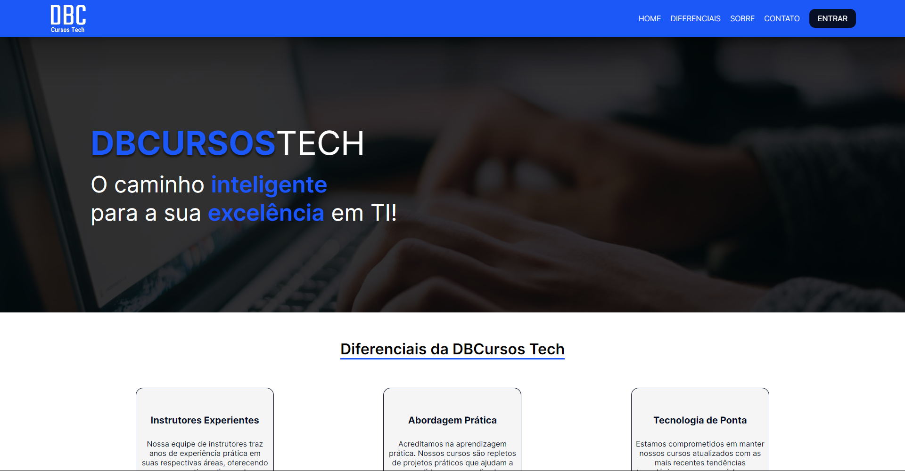

<h1 align="center"> Task Final | Context + Styled Components</h1>

<p align="center">
Tarefa avaliativa do Programa Vem Ser, 12ª Edição.
</p>

<p align="center">
<strong>Desenvolvedores:</strong> <br>Davi Kennedy<br>Diego Domanjnko<br>Fabiola Rodrigues<br>Glauber Bispo<br>Marcos Silva
</p>

<p align="center">
  <a href="#-tecnologias">Tecnologias</a>&nbsp;&nbsp;&nbsp;|&nbsp;&nbsp;&nbsp;
    <a href="#-instalacao-do-projeto">Instalação do projeto</a>&nbsp;&nbsp;&nbsp;|&nbsp;&nbsp;&nbsp;
  <a href="#-sobre-o-projeto">Sobre o Projeto</a>&nbsp;&nbsp;&nbsp;
</p>

<p align="center">
  
</p>

<p align="center">
  <a href="https://dbcursos-tech.vercel.app/" target="_blank">➡️ Acesse o deploy!</a>
</p>

## 🚀 Tecnologias

Esse projeto foi desenvolvido com as seguintes tecnologias:

- TypeScript
- React
- Styled-components

## ⚙️ Instalação do projeto

Instalação das dependências:
```
npm i
```

Inicialização da aplicação:
```
npm start
```

Comando para vizualizar a cobertura de testes da aplicação:
```
npm run test-coverage
```


## 💻 Sobre o Projeto

A DBCursos Tech é uma plataforma educacional que pode ser acessada por alunos e professores. Nela, é possível acessar cursos, professores e/ou alunos. Também há a área do admin, que tem funções administrativas, tais como: adicionar, remover ou editar qualquer registro. 

<a href="https://www.figma.com/file/dcERvcVZvfxlD0HufLWlUl/DBCursos?type=design&node-id=1%3A22&mode=design&t=jBuObXNYjwQE4Fyr-1">Veja aqui</a> o projeto no Figma.

[Veja aqui](https://trello.com/b/eThYVSjZ/kanban-dbcursos-tech) o Trello.
